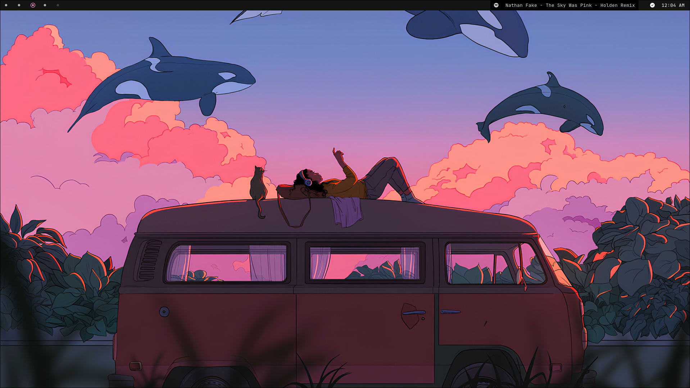
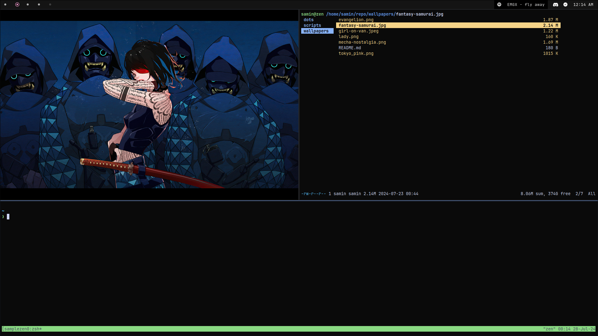
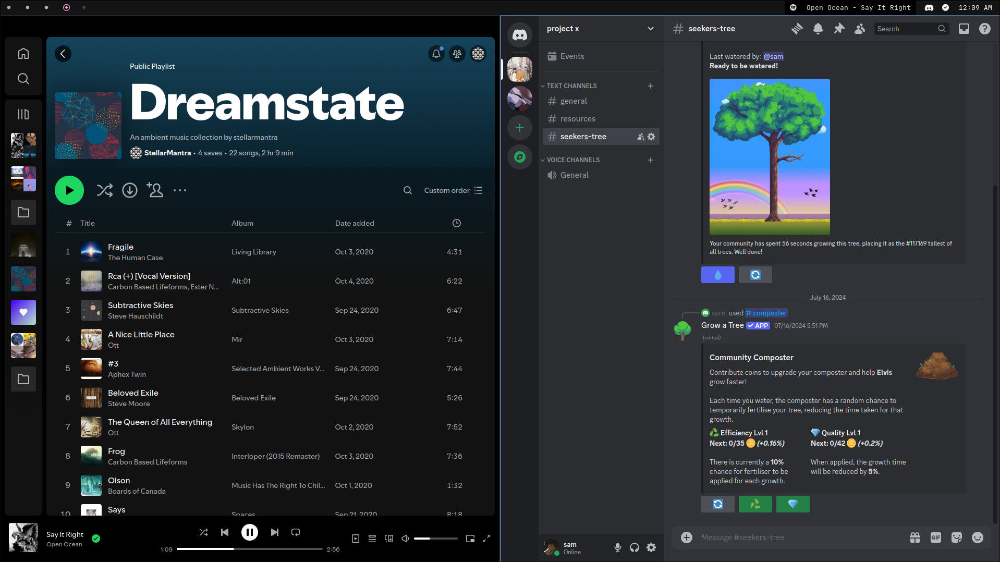

# Zen dots
Minimal performance/productivity-oriented setup without sacrificing aesthetics.

## Linux daily driver configurations

Sys : 
```yml
OS: Arch Linux
Kernel: Linux
Shell: zsh
WM: Hyprland (Wayland)
Theme: Colloid-Pink-Dark [GTK2/3]
Icons: AdwaitaLegacy [GTK2/3]
Font: JetBrainsMono Nerd Font (11pt, Thin) [GTK2/3]
Cursor: capitaine (22px)
Terminal: alacritty
CPU: AMD Ryzen 5 5600 (12) @ 3.50 GHz
GPU: Intel Arc A750 @ 2.40 GHz [Discrete]
```

### preview 









